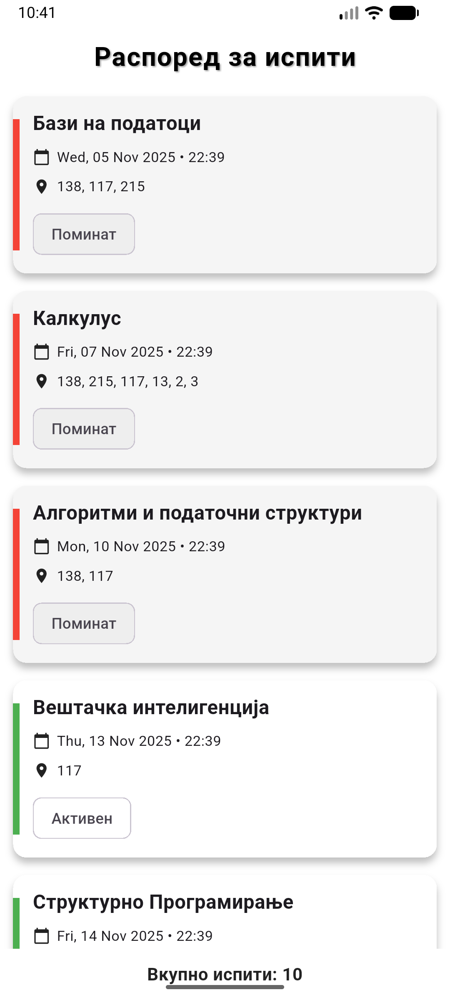
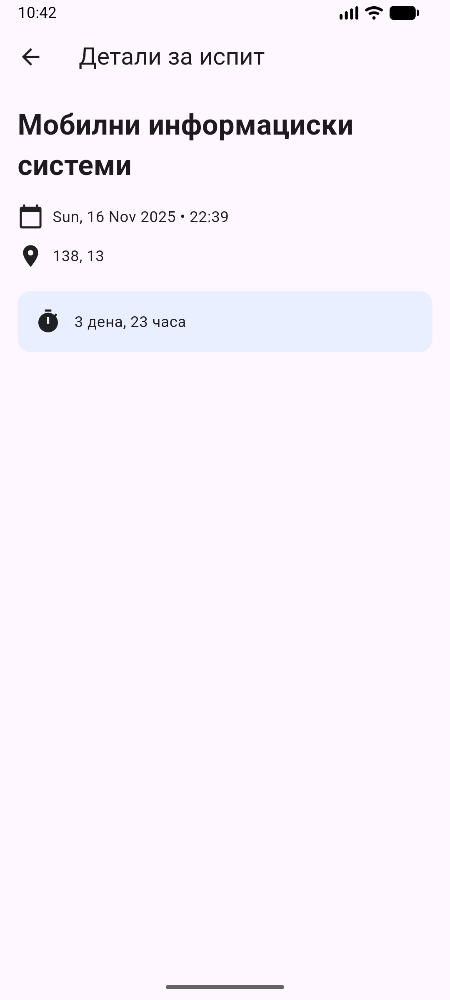
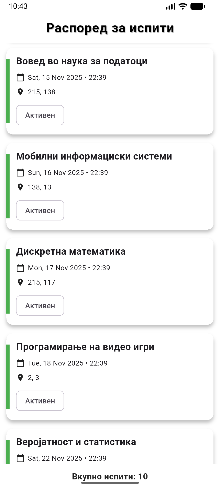
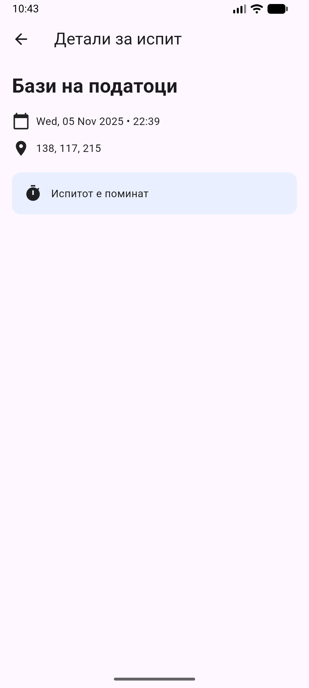

# Exam Schedule Flutter App

## 1. Short Description

A mobile application built with Flutter that displays a chronological schedule of exams, including detailed information and countdowns to upcoming exams.

---

## 2. Demo / Screenshots

<p align="center">
  
  
  
  
</p>

<p align="center">
  
</p>

---

## 3. Features

-  Displays a list of exams sorted by date and time
-  Highlights past vs upcoming exams with different colors
-  Detailed exam view with remaining time countdown
-  Shows exam locations (rooms) clearly
-  Displays total number of exams

---

## 4. Tech Stack

- **Flutter** — UI framework
- **Dart** — Programming language
- **Material Design** (Material 3)
- **Android Emulator / Physical Device** for testing

---

## 5. Installation

### Clone the repository

```bash
git clone https://github.com/your-username/exam_schedule_app.git
cd exam_schedule_app
```

### Install dependencies

```bash
flutter pub get
```

### Check environment

```bash
flutter doctor
```

---

## 6. Usage

### Run the application

```bash
flutter run
```

Make sure an emulator or physical device is connected. The app will launch and display the exam schedule.

---

## 7. Project Structure

```

lib/
│
├── models/
│   └── exam.dart
│
├── screens/
│   └── exam_detail_screen.dart
│
├── widgets/
│   └── exam_card.dart
│
└── main.dart

```

## 8. Example Output

###  Home Screen

- List of exams displayed as cards
- Sorted chronologically
- Color-coded (past vs upcoming)

###  Detail Screen

- Full exam information
- Remaining time displayed as: `X days, Y hours`
